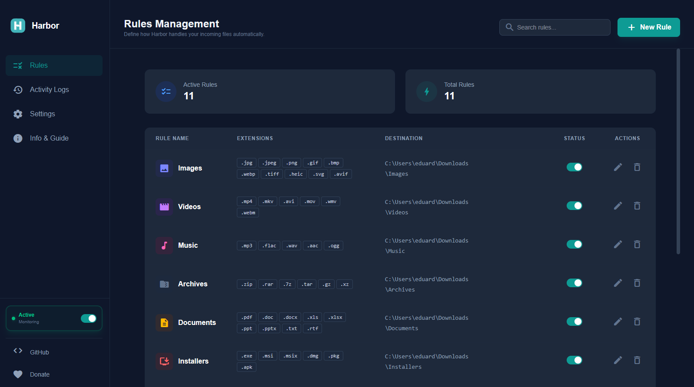

# ⚓ Harbor
**The Modern Download Organizer & File Manager**

*Keep your workspace clean, automatically.*

---

### Stop digging through your Downloads folder.
**Harbor** is a lightweight Windows utility that monitors your downloads in real-time and moves files to categorized folders based on your own custom rules.

---

## ✨ Features

- **🔄 Auto-Organization** - Automatically sorts downloads by file type (images, videos, documents, etc.)
- **🎛️ Simple Tray Interface** - Start/Stop watching, organize now, or access recent activity
- **⚡ No Admin Required** - Installs and runs with user permissions only
- **🔗 Smart Symlinks** - Optionally leave hidden shortcuts so your browser doesn't "lose" files
- **📝 Activity Log** - Track what was moved and when in `recent_moves.log`
- **⚙️ Customizable Rules** - Edit via the UI or directly in the YAML config
- **🚀 Auto-Start** - Launches automatically on Windows startup
- **💾 Safe Moves** - Avoids partial downloads (`.crdownload`, `.part`, `.tmp`)
- **🔄 Conflict Handling** - Automatically renames files if destination already exists

---

## 📦 Quick Start

1. **Download:** Get the latest `.msi` from [Releases](https://github.com/eduard-lt/Harbor-Download-Organizer/releases).
2. **Launch:** Open Harbor from your System Tray.
3. **Organize:** Use the 11 built-in rules or create your own in the **Rules Management** dashboard.
4. **Relax:** Turn on **Active Monitoring** and let Harbor handle the rest.

---

## 🗺️ Roadmap

We are constantly working to make Harbor better. Here is what's on the horizon:
- [ ] 🐧 **Linux Support** - Bringing native organization to Linux desktops
- [ ] 🍎 **macOS Support** - Optimization for Apple Silicon and Intel Macs
- [ ] 📂 **Multi-Folder Monitoring** - Watch more than just your Downloads folder
- [ ] 🔔 **Custom Notifications** - Get alerts when files are moved or rules are triggered

---

## 🤝 Contributing & Support

Contributions are what make the open-source community such an amazing place to learn, inspire, and create.

- **Found a bug?** [Open an issue](https://github.com/eduard-lt/Harbor-Download-Organizer/issues)
- **Have an idea?** [Submit a feature request](https://github.com/eduard-lt/Harbor-Download-Organizer/issues)
- **Want to help?** PRs are always welcome! Check the [Building](#-building-from-source) section to get started.

---

## 🛠️ Building from Source

Harbor is a **Tauri v2** application (React + Rust).

1. **Install:** Node.js 20+, Rust (Stable), WiX Toolset v3, Python 3.10+ and [Poe the Poet](https://poethepoet.natn.io/installation.html)
2. **UI Setup:** `cd packages/ui && npm install`
3. **Dev:** `poe dev`
4. **Build:** `poe build`

---

## 📝 License

Harbor is released under the **MIT License**. This means you are free to use it commercially, modify it, and distribute it—just keep the original copyright notice.

---

### Support the Project
If Harbor has made your life easier, please consider giving us a ⭐!

Made with ❤️ by [Eduard Olteanu](https://github.com/eduard-lt)

